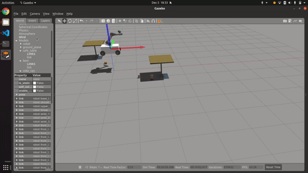
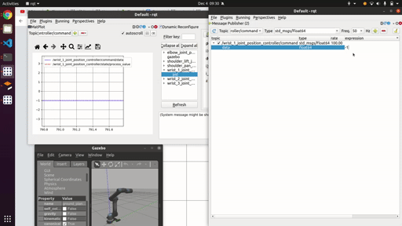
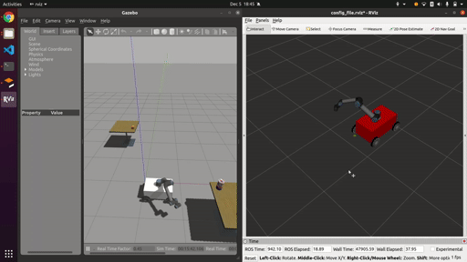

# Enpm662 Final Project - Omni Directional Bot with UR5 Arm

## Documents:
1. Link to report, discussions are [here](https://drive.google.com/drive/folders/1Rp32GsWSPNQBrzzu0iJeZsF_Ti1MLDRo?usp=sharing)
2. Jacobian calculation was done in MATLAB file which can be found [here](assets/).

## Setup
 - Clone this repository into your catkin_ws:
    ```
    git clone https://github.com/aswathselvam/enpm662_final_project.git
    catkin_make
    source devel/setup.bash
    ```

 - If running ROS Noetic, you might have to run this command in the terminals you open:
    ```
    mkdir ~/bin
    PATH=~/bin:$PATH
    ln -s /usr/bin/python3 ~/bin/python
    ```
    Subsequently, you can add `PATH=~/bin:$PATH` to `~/.bashrc`. 

 - The python [reqirements.txt](./requirements.txt) file can be used to install the required python library dependencies. \
 Install the libraries by using the following command:
    ```
    pip install -r requirements.txt
    ```


## Unit Test
Video shows the arm's End effector is moved in [X,Y](https://youtu.be/7pDdwMx3wy0) and [Z](https://youtu.be/ckWtDDp8nYo) coordinates using Inverse Jacobian method. 

## Test

1. Gazebo simulation:

    
    *Full Video Youtube [link](https://youtu.be/qoDo5TzVyWU)*


- Run Vegetation pest survey Environment:
  ``` bash
  # Vegetation word Gazebo launch
  roslaunch enpm662_final_project gazebo_test_robot.launch
  ```
  - Attend to pests on bushes in the field using the command:
  ```bash
  # Run Attend to Pests node
  rosrun enpm662_final_project attend_to_pests.py
  ```


2. Run sample world file:


    
  
  
 - Launch the sample world file:
   ```bash
   # Objects world Gazebo launch
   roslaunch enpm662_final_project gazebo_test_robot.launch argworld:=objects
   ```

   - Touch objects in environment using these commands:
   ```bash
   # Run Go to Goals node
   rosrun enpm662_final_project go_to_goals.py
   ```

3. Run Teleop for UR5 Arm using Inverse Jacobian using:
    ```bash
    # Mecanum control node listener node
    rosrun enpm662_final_project teleop_arm.py
    ```


4. For Teleop for chassis run these 2 nodes:
    ```bash
    # Mecanum control node listener node
    rosrun enpm662_final_project test_mecanum_robot.py
    ```

    ```bash
    # Teleop control node
    rosrun enpm662_final_project test_publisher.py
    ```

## Data visualization:
Plot joint angles with RQT:


```
roslaunch enpm662_final_project rqt_vis.launch  
```

Visualize in Rviz:


```
# Rviz visualization:
roslaunch enpm662_final_project rviz.launch
```

## World file & Models:
1. The bush model is taken from this [repository](https://github.com/kubja/gazebo-vegetation).
2. The world file is take from Agribot [repository](https://github.com/PRBonn/agribot).
3. Mecanum Wheel [FM202-205-15U-R/L (FUJI)](http://www.fuji-bearing.com/japanese/products/conveyor/conveyor0408.html)
gazebo model description.
